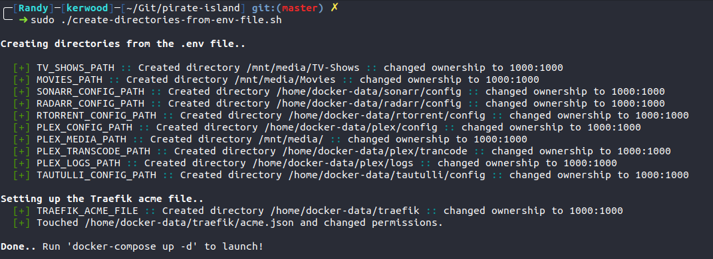

# Pirate Cove
Welcome to the Pirate Cove.  
This is a complete container setup with the following software.

### tl;dr
  - Edit the `.env` file.
  - Run `docker-compose up -d`
  - Profit

## Sonarr
Sonarr is a PVR for Usenet and BitTorrent users. It can monitor multiple RSS feeds for new episodes of your favorite shows and will grab, sort and rename them. It can also be configured to automatically upgrade the quality of files already downloaded when a better quality format becomes available.

Website: [https://sonarr.tv/](https://sonarr.tv/)  
Github: [https://github.com/Sonarr/Sonarr](https://github.com/Sonarr/Sonarr)  
Container: [linuxserver/sonarr](https://hub.docker.com/r/linuxserver/sonarr/)  
Container Github: [https://github.com/linuxserver/docker-sonarr](https://github.com/linuxserver/docker-sonarr)

[](https://microbadger.com/images/linuxserver/sonarr "Get your own version badge on microbadger.com")


[](https://ci.linuxserver.io/job/Docker-Pipeline-Builders/job/docker-sonarr/job/master/)
[](https://lsio-ci.ams3.digitaloceanspaces.com/linuxserver/sonarr/latest/index.html)

## Radarr
Radarr is an independent fork of Sonarr reworked for automatically downloading movies via Usenet and BitTorrent.

Website: [https://radarr.video/](https://radarr.video/)  
Github: [https://github.com/Radarr/Radarr](https://github.com/Radarr/Radarr)  
Container: [linuxserver/radarr](https://hub.docker.com/r/linuxserver/radarr/)  
Container Github: [https://github.com/linuxserver/docker-radarr](https://github.com/linuxserver/docker-radarr)

[](https://microbadger.com/images/linuxserver/radarr "Get your own version badge on microbadger.com")


[](https://ci.linuxserver.io/job/Docker-Pipeline-Builders/job/docker-radarr/job/master/)
[](https://lsio-ci.ams3.digitaloceanspaces.com/linuxserver/radarr/latest/index.html)

## Jackett
Jackett works as a proxy server: it translates queries from apps (Sonarr, Radarr, SickRage, CouchPotato, Mylar, Lidarr, DuckieTV, qBittorrent, Nefarious etc) into tracker-site-specific http queries, parses the html response, then sends results back to the requesting software. This allows for getting recent uploads (like RSS) and performing searches.

Github: [https://github.com/Jackett/Jackett](https://github.com/Jackett/Jackett)  
Container: [linuxserver/jackett](https://hub.docker.com/r/linuxserver/jackett/)  
Container Github: [https://github.com/linuxserver/docker-jackett](https://github.com/linuxserver/docker-jackett)

[](https://microbadger.com/images/linuxserver/jackett "Get your own version badge on microbadger.com")


[](https://ci.linuxserver.io/job/Docker-Pipeline-Builders/job/docker-jackett/job/master/)
[](https://lsio-ci.ams3.digitaloceanspaces.com/linuxserver/jackett/latest/index.html)


## Rtorrent/Rutorrent
ruTorrent is a front-end for the popular Bittorrent client rtorrent.

Container: [linuxserver/rutorrent](https://hub.docker.com/r/linuxserver/rutorrent/)  
Container Github: [https://github.com/linuxserver/docker-rutorrent](https://github.com/linuxserver/docker-rutorrent)  

[](https://microbadger.com/images/linuxserver/rutorrent "Get your own version badge on microbadger.com")


[](https://ci.linuxserver.io/job/Docker-Pipeline-Builders/job/docker-rutorrent/job/master/)
[](https://lsio-ci.ams3.digitaloceanspaces.com/linuxserver/rutorrent/latest/index.html)


## Plex
Plex media server allows you to aggregate all your personal media and access it anywhere you go. Enjoy your own content on all your devices with Plex.

Website: [https://www.plex.tv/](https://www.plex.tv/)  
Container: [plexinc/pms-docker](https://hub.docker.com/r/plexinc/pms-docker/)  
Container Github: [https://github.com/plexinc/pms-docker](https://github.com/plexinc/pms-docker)

## Tautulli
A Python based monitoring and tracking tool for Plex Media Server. Formerly known as PlexPy.

Website: [https://tautulli.com/](https://tautulli.com/)  
Github: [https://github.com/Tautulli/Tautulli](https://github.com/Tautulli/Tautulli)  
Container: [tautulli/tautulli](https://hub.docker.com/r/tautulli/tautulli/)  
Container Github: [https://github.com/Tautulli/Tautulli-Docker](https://github.com/Tautulli/Tautulli-Docker)


## Traefik
Traefik is a modern HTTP reverse proxy and load balancer that makes deploying microservices easy. 

Website: [https://traefik.io/](https://traefik.io/)  
Github: [https://github.com/containous/traefik](https://github.com/containous/traefik)  
Container: [traefik](https://hub.docker.com/_/traefik)

[](https://microbadger.com/images/traefik)
[](https://github.com/containous/traefik/blob/master/LICENSE.md)
[](https://semaphoreci.com/containous/traefik)
[](https://docs.traefik.io)
[](http://goreportcard.com/report/containous/traefik)


# Setup your Pirate Cove.

First a few rerequisites.
  - A public domain name. Buy one at [https://www.namecheap.com/](https://www.namecheap.com/)
  - Docker :: [https://docs.docker.com/get-started/](https://docs.docker.com/get-started/)
  - Docker Compose :: [https://github.com/docker/compose/releases](https://github.com/docker/compose/releases)
  - Ports 80/tcp and 443/tcp open for web access and Traefik to get certificates.
  - Ports 51413/tcp and 6881/udp open for Rtorrent.

### Edit the .env file
All configuration to this setup, I've put in the `.env` file, so all you have to do is go through it and edit it to fit your needs.

First off, Traefik provides basic authentication for the web services, all except Plex which has its only user management. To create the `user:password` string, run below command and replace the `BASIC_AUTH` variable with the result.

```
docker run -it --rm httpd bash -c "htpasswd -nB username-here"
```

If you dont want to create all the folder paths manually, I have included a small shell script called `create-directories-from-env-file.sh` that does that for you and changes the ownership to the `PUID` and `PGID` variable. It also creates the `acme.json` file that Traefik stores its certificates in.

It looks something like this.



If you haven't figured it out yet, this setup comes with a reverse proxy, Traefik. That is why all web services have a `*_DOMAIN_NAME` variable. You need to create the A records for the domain names that you provide in the `.env` file, like.
 - sonarr.example.org
 - radarr.example.org
 - jackett.example.org
 - rtorrent.example.org
 - plex.example.org
 - plexmon.example.org
 - traefik.example.org

Traefik will get certificates for the provides domain names.  
At the bottom of the `.env` file you will find the the `STAGING_ENVIRONMENT` variable. As long as you are testing the setup, keep this variable, it will trigger the staging environment at Lets Encrypt. If you keep tesing on production you will hit the rate limit and get temprary banned. When you are ready for production, just uncomment the line. `acme.json` is the file where Traefik keeps all its certificates. Should you choose to create the `acme.json`file your self, remember to `chmod` it `600`.